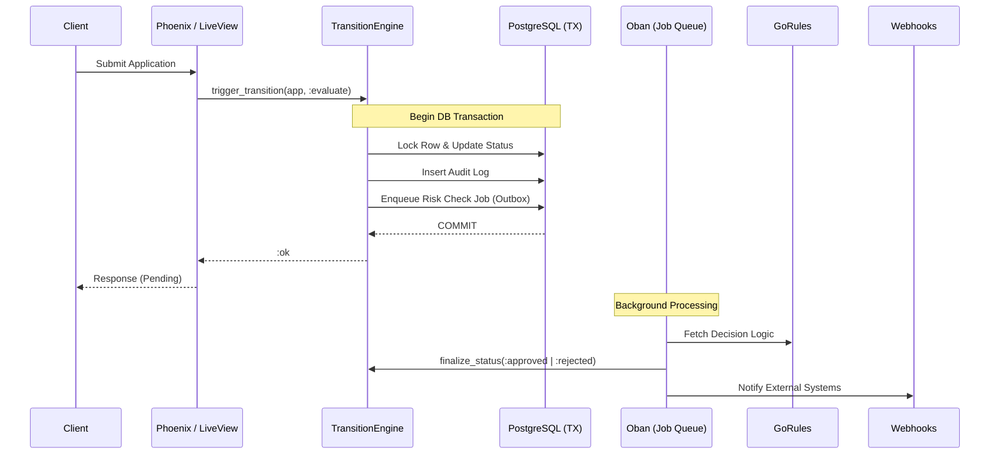

# GlobalTaskFintech

A robust, event-driven FinTech application for managing global credit application workflows with country-specific business rules.

## 🏗️ Architecture Overview

The system is built on **Hexagonal Architecture** principles, ensuring a clean separation between domain logic and infrastructure. It leverages the **Transactional Outbox Pattern** to guarantee consistency between state changes and background side effects.

### System Components


### Core Domain Lifecycle


---

## 🚀 Getting Started

### 1. Local Development (Mix)
1. Clone the repository:
   ```bash
   git clone https://github.com/your-repo/global_task_fintech.git
   cd global_task_fintech
   ```
2. Setup environment variables:
   ```bash
   cp .env.example .env
   # Update .env with your local credentials
   ```
3. Install dependencies and setup database:
   ```bash
   mix setup
   ```
4. Start the server:
   ```bash
   mix phx.server
   ```

### 2. Docker Compose
Start the entire stack (App, DB, GoRules):
```bash
docker compose build
docker compose up -d
```
Access at `http://localhost:4000`.

### 3. Kubernetes (Local Testing with Kind)
1. Apply manifests:
   ```bash
   kubectl apply -f k8s/
   ```
2. Run migrations:
   ```bash
   kubectl apply -f k8s/migration-job.yaml
   ```
3. Port-forward:
   ```bash
   kubectl port-forward svc/app-service 4000:4000 -n global-task-fintech
   ```

---

## 🛠️ Reliability Features

### 1. Data Consistency & Integrity
- **Transactional Outbox Pattern**: All domain logic and side effects (Audit logs, Risk Engine evaluation, Webhook delivery) are persisted within a single **PostgreSQL Transaction**.
- **Row-Level Locking**: The `TransitionEngine` uses `SELECT ... FOR UPDATE` to prevent race conditions during concurrent status transitions.
- **Idempotent Job Design**: Background workers (Oban) use **Uniqueness Constraints** to ensure jobs aren't processed multiple times.

### 2. Security & Compliance
- **PII Encryption**: Sensitive data like `document_number` is encrypted using **Cloak.Ecto** (AES.GCM) with keys managed via environment variables.
- **Auditability**: Every state change is recorded in an `audit_logs` table within the same transaction.

### 3. Horizontal Scalability
- **Distributed PubSub**: Real-time UI updates (LiveView) work across nodes using Phoenix.PubSub.
- **Distributed Erlang**: Pods can form a cluster for state sharing and distributed task execution.

