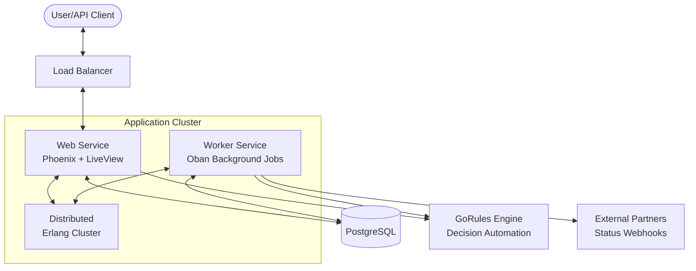
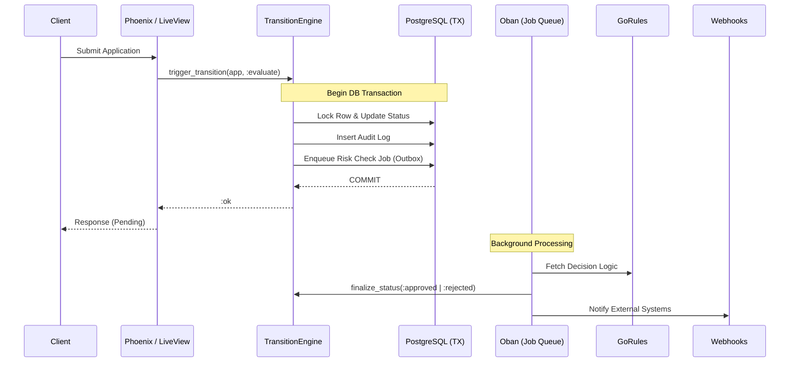
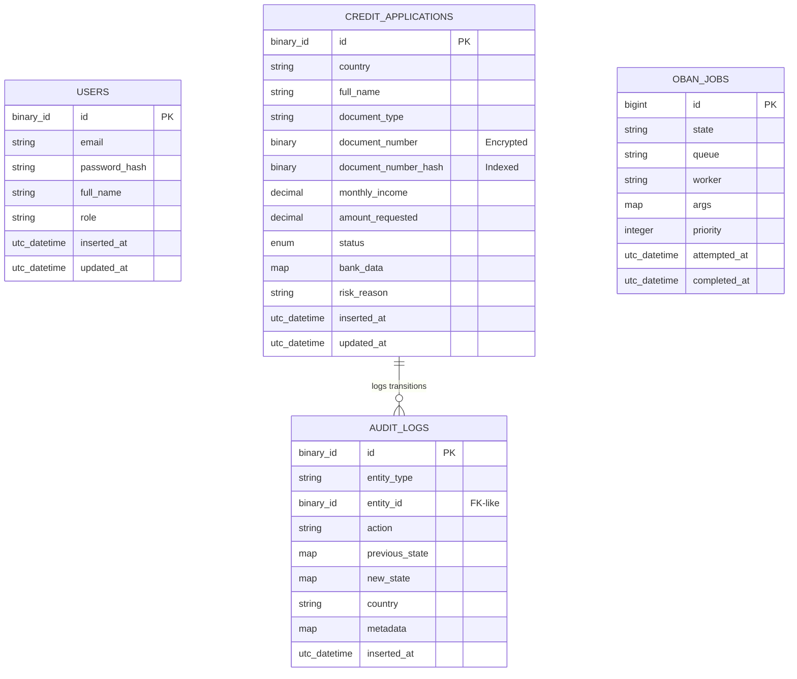

# GlobalTaskFintech

FinTech application for managing global credit application workflows with country-specific business rules.

## 🏗️ Architecture Overview

The system is built on **Hexagonal Architecture** principles, ensuring a clean separation between domain logic and infrastructure. It leverages the **Transactional Outbox Pattern** to guarantee consistency between state changes and background side effects.

### System Components


### Core Domain Lifecycle


### Database Schema


---


## 🧠 Business Rules Engine (GoRules)

This project leverages **[GoRules Zen Engine](https://gorules.io/)** to manage complex decision-making logic outside of the core application code.

- **Dynamic Evaluation**: Decisions such as risk scoring, eligibility checks, and country-specific field requirements are handled by GoRules.
- **Rule Management**: Business rules are defined as decision tables/trees in the `gorules/rules/` directory.
- **Seamless Integration**: The `BusinessRulesClient` provides an idiomatic Elixir interface to evaluate these rules via a lightweight JSON API.

---

## 🏦 Bank Providers

The system uses a **Normalization Layer** to interact with different banking APIs across countries.

- **Strategy Pattern**: Different providers (e.g., `MxBankProvider`, `CoBankProvider`) implement the same behavior to fetch bank data.
- **Configuration**: Providers are mapped in `config/config.exs` based on the application's country:
  ```elixir
  bank_providers: %{
    "MX" => GlobalTaskFintech.Infrastructure.Banks.MxBankProvider,
    "CO" => GlobalTaskFintech.Infrastructure.Banks.CoBankProvider
  }
  ```
- **Normalization**: Each provider maps native API responses into a unified `bank_data` structure used by the Risk Engine.

---

## 🚦 State Machine & Transitions

Application state is managed by a centralized **Transition Engine** that ensures strict workflow compliance.

- **Workflow Validation**: Each country (MX, CO) has a defined set of allowed transitions (e.g., `pending -> risk_check` is allowed, but `rejected -> approved` is not).
- **Side Effects**: Transitions trigger synchronous or asynchronous side effects, such as enqueuing Oban jobs for risk evaluation or audit logging.
- **Audit Trails**: Every transition is automatically recorded in the `audit_logs` table (Transactional Outbox).

---

## ⚡ Caching Layer

To optimize performance and reduce latency, the system implements an internal cache for external service calls.

- **ETS Adapter**: By default, the `EtsAdapter` caches Rule Engine evaluation results.
- **Deduplication**: Frequent calls with the same "facts" (e.g., income, amount) are served from memory instead of hitting the GoRules API.
- **Extensibility**: The caching layer follows a clear adapter pattern, allowing easy swapping with Redis or Memcached in high-traffic environments.

---

## 🚀 Getting Started

### 1. Local Development (Mix)
1. Clone the repository:
   ```bash
   git clone https://github.com/your-repo/global_task_fintech.git
   cd global_task_fintech
   ```
2. Setup environment variables:
   ```bash
   cp .env.example .env
   # Update .env with your local credentials
   ```
3. Install dependencies and setup database:
   ```bash
   mix setup
   ```
4. Start the server:
   ```bash
   mix phx.server
   ```

### 2. Docker Compose
Start the entire stack (App, DB, GoRules):
```bash
docker compose up -d
```
Access at `http://localhost:4000`.

### 3. Kubernetes (Local Testing with Kind)
1. Apply manifests:
   ```bash
   kubectl apply -f k8s/
   ```
2. Run migrations:
   ```bash
   kubectl apply -f k8s/migration-job.yaml
   ```
3. Port-forward:
   ```bash
   kubectl port-forward svc/app-service 4000:4000 -n global-task-fintech
   ```

---

## 🛠️ Reliability Features

### 1. Data Consistency & Integrity
- **Transactional Outbox Pattern**: All domain logic and side effects (Audit logs, Risk Engine evaluation, Webhook delivery) are persisted within a single **PostgreSQL Transaction**.
- **Row-Level Locking**: The `TransitionEngine` uses `SELECT ... FOR UPDATE` to prevent race conditions during concurrent status transitions.
- **Idempotent Job Design**: Background workers (Oban) use **Uniqueness Constraints** to ensure jobs aren't processed multiple times.

### 2. Security & Compliance
- **PII Encryption**: Sensitive data like `document_number` is encrypted using **Cloak.Ecto** (AES.GCM) with keys managed via environment variables.
- **Auditability**: Every state change is recorded in an `audit_logs` table within the same transaction.

### 3. Horizontal Scalability
- **Distributed PubSub**: Real-time UI updates (LiveView) work across nodes using Phoenix.PubSub.
- **Distributed Erlang**: Pods can form a cluster for state sharing and distributed task execution.

---

## 🔌 API Documentation

All API requests expect `Content-Type: application/json` and return JSON responses.

### 1. Authentication
**POST** `/api/v1/login`

Returns a JWT token required for all other endpoints (except webhooks).

**Request Body:**
```json
{
  "email": "user@example.com",
  "password": "password123"
}
```

**Success Response:** `200 OK`
```json
{
  "status": "success",
  "token": "eyJhbGciOiJIUzI1NiIsInR5cCI6IkpXVCJ9...",
  "user": { "email": "user@example.com", "role": "admin" }
}
```

---

### 2. Credit Applications
All endpoints require `Authorization: Bearer <token>`. Write operations (`POST`, `PUT`, `DELETE`) require **admin** role.

#### **GET** `/api/v1/credit-applications`
List all applications. Supports filtering (e.g., `?status=pending`).

#### **GET** `/api/v1/credit-applications/:id`
Fetch details of a specific application.

#### **POST** `/api/v1/credit-applications`
Create a new application.

**Request Body:**
```json
{
  "credit_application": {
    "country": "MX",
    "full_name": "Juan Perez",
    "document_type": "curp",
    "document_number": "ABC123456789012345",
    "monthly_income": 50000,
    "amount_requested": 150000,
    "status": "pending"
  }
}
```

---

### 3. Webhooks & Status Changes
**POST** `/api/webhooks/receive`

The webhooks endpoint handles asynchronous status updates from external partners (e.g., manual reviewers, document verification services).

- **State Validation**: Incoming status updates are piped through the `TransitionEngine`. If a transition is legally impossible (e.g., trying to set a `rejected` app to `risk_check`), the API returns `422 Unprocessable Entity`.
- **Reasoning**: Always include a `reason` to populate the `risk_reason` field and audit log.

**Request Body:**
```json
{
  "application_id": "aa92cd8c-2ecf-4445-9ac6-0dcda74b1bbd",
  "status": "approved",
  "reason": "Risk check passed successfully"
}
```

**Workflow Example:**
1. App is created -> `pending`
2. Risk Job is processed -> Rules Engine sets it to `manual_review`
3. External Webhook arrives -> Sets it to `approved` (Valid transition)

---

## 🧪 Testing & Quality

The project maintains high code quality through automated testing, linting, and static analysis.

### 1. Running Tests
Execute the full test suite using:
```bash
mix test
```

### 2. Code Coverage
Generate a coverage report using **ExCoveralls**:
```bash
mix coveralls.html
```
The report will be available in the `cover/` directory.

### 3. Static Analysis & Linting
Ensure the code adheres to the project's style guide and type safety:

- **Credo**: For code style and consistency.
  ```bash
  mix credo
  ```
- **Dialyzer**: For static type checking.
  ```bash
  mix dialyzer
  ```

---

## 🏗️ Environment Variables

- `SECRET_KEY`: Used for sessions and cookie signing.
- `ENCRYPTION_KEY`: Base64 key for database-level PII encryption.
- `DATABASE_URL`: Connection string for PostgreSQL.
- `BUSINESS_RULES_BASE_URL`: URL for the GoRules BRMS service.
- `WEBHOOK_STATUS_UPDATE_URL`: (Optional) URL to notify when statuses change.


